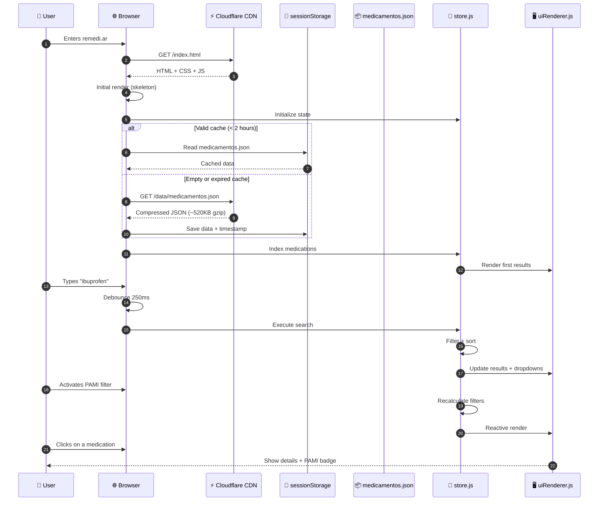
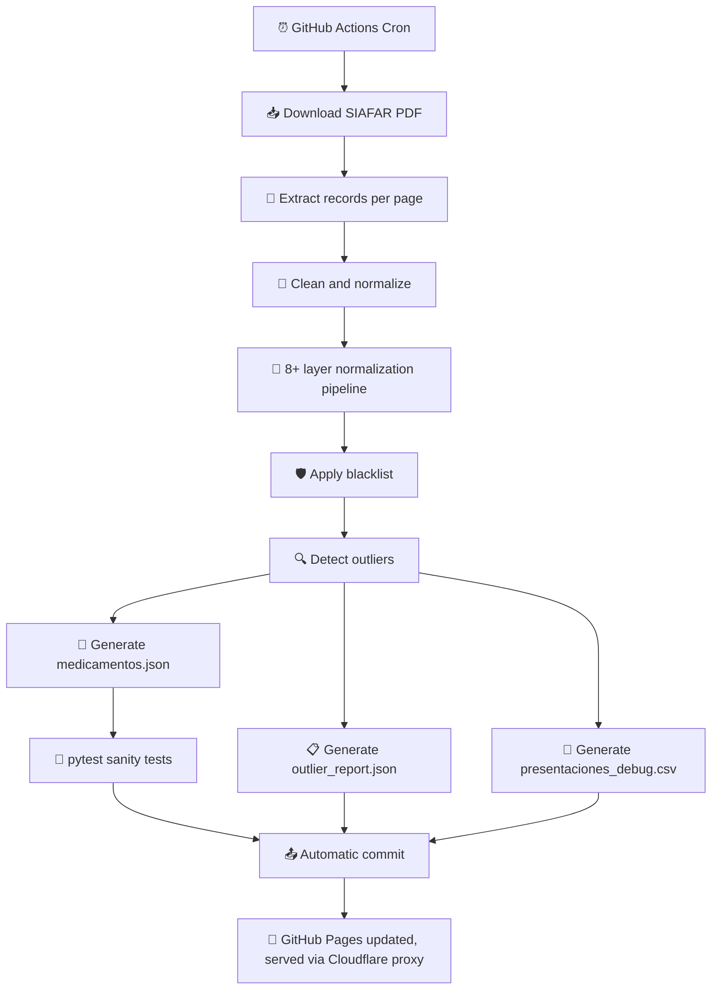
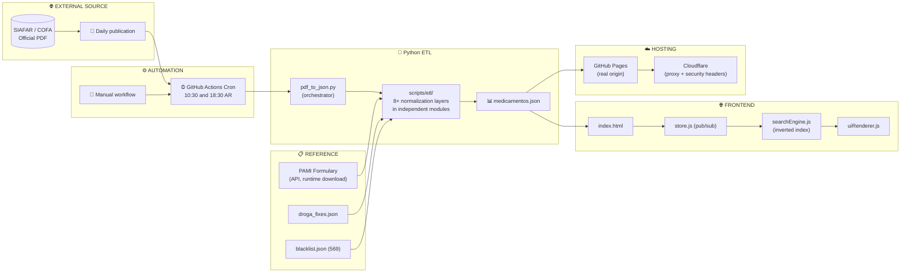
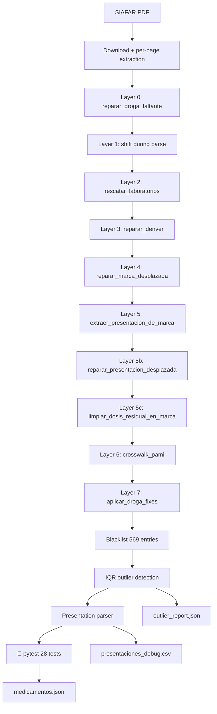
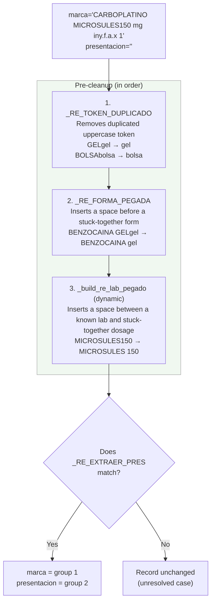
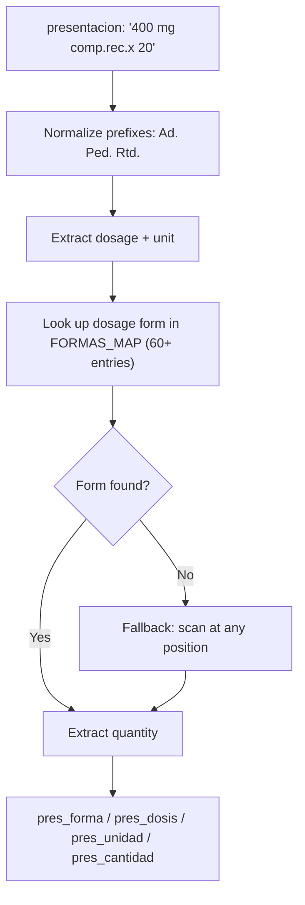
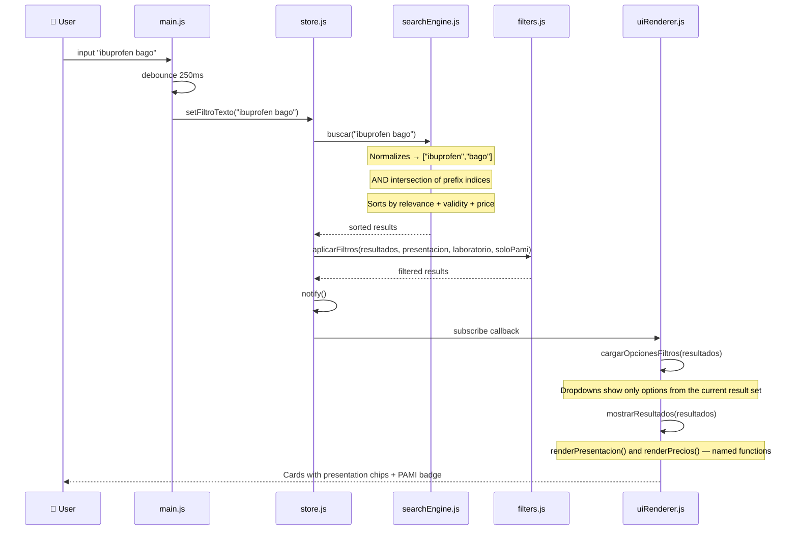
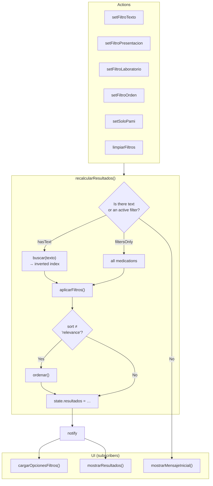
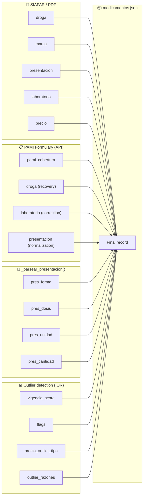

<p align="center">
  
</p>

# remedi.ar — Medication price search engine in Argentina

<p align="center">
  <strong>Medication price search engine in Argentina</strong><br>
  <em>Open source system that processes official SIAFAR/COFA/PAMI data and generates a price comparator updated automatically twice a day.</em>
</p>

<p align="center">
  <a href="https://remedi.ar">https://remedi.ar</a> ·
  <a href="https://github.com/psbella/remediar">GitHub</a>
</p>

---

<p align="left">
<!-- Version -->


<br>
<!-- Hosting & License -->


<br>
<!-- Values -->


<br>
<!-- Frontend -->


<br>
<!-- Technologies -->


<br>
<!-- Backend / Automation -->


<br>
<!-- Data -->

<br>
<!-- Diagrams -->

<br>
<!-- Features -->


</p>

---

> 🇦🇷 **[Versión en español](./README.md)** — this is a 1:1 translation of the Spanish README. If anything looks out of sync between the two, the Spanish version is the source of truth (it's the maintainer's working language).

---

# 📋 Table of Contents

- [✨ Live Demo](#-live-demo)
- [📊 Current Dataset](#-current-dataset)
- [🎯 General Operation](#-general-operation)
- [🧭 Project Principles](#-project-principles)
- [👤 User Flow](#-user-flow)
- [🧠 Search and Filtering Algorithm](#-search-and-filtering-algorithm)
- [🔄 Automatic Data Updates](#-automatic-data-updates)
- [📦 JSON Data Structure](#-json-data-structure)
- [⚡ Optimizations Implemented](#-optimizations-implemented)
- [⏱️ Response Times](#️-response-times)
- [🏗️ System Architecture](#️-system-architecture)
- [📁 Repository Structure](#-repository-structure)
- [🧰 Tech Stack](#-tech-stack)
- [🧠 Technical Decisions](#-technical-decisions)
- [💻 Local Execution](#-local-execution)
- [🐍 Python Scripts](#-python-scripts)
- [📊 Metrics and Performance](#-metrics-and-performance)
- [🔍 SEO and Metadata](#-seo-and-metadata)
- [🔒 Security and Privacy](#-security-and-privacy)
- [🔌 Unofficial API](#-unofficial-api)
- [👥 Contribution Guide](#-contribution-guide)
- [📊 Detailed Flow Diagrams](#-detailed-flow-diagrams)
- [🧩 Frontend Component Reference](#-frontend-component-reference)
- [🎨 CSS Style Guide](#-css-style-guide)
- [🔧 Workflow Documentation](#-workflow-documentation)
- [❓ Frequently Asked Questions (FAQ)](#-frequently-asked-questions-faq)
- [⚠️ Known Limitations](#️-known-limitations)
- [🗺️ Roadmap](#️-roadmap)
- [📄 License](#-license)
- [🙏 Data Source](#-data-source)

---

# ✨ Live Demo

| Environment | URL | Purpose |
|---|---|---|
| GitHub Pages (own domain, DNS on Cloudflare) | [remedi.ar](https://remedi.ar) | Production — hosted on GitHub |
| GitHub Pages (default domain) | [psbella.github.io/remediar](https://psbella.github.io/remediar/) | Mirror/backup |
| Cloudflare Workers | [remediar.pablo-s-bella.workers.dev](https://remediar.pablo-s-bella.workers.dev/) | Mirror/backup |

> **Security headers:** `remedi.ar` and `www.remedi.ar` are proxied (orange cloud) on Cloudflare, with GitHub Pages as the origin. CSP, `X-Frame-Options`, and the rest of the security headers are applied via **Cloudflare Response Header Transform Rules** (dashboard), not from the repo's `_headers` file — that file is only processed by the Workers mirror. See [`_headers`](./_headers) for the detail of the replicated values.

---

---

# 📊 Current Dataset

| Metric | Value |
|---|---|
| Records | ~12,100 |
| Unique drugs | ~1,740 |
| JSON size | ~2.5 MB |
| Gzip size | ~520 KB |
| With PAMI coverage | ~5,900 (49%) |
| Blacklist entries | 569 |
| Presentation parser coverage | ~99.5% |
| Updates | 2x/day (Monday to Friday) |
| Sanity tests | 28 automated checks post-ETL |

---

# 🎯 General Operation

The system is made up of three main layers:

## 1️⃣ Extraction and processing

- GitHub Actions runs an automated workflow twice a day (Monday to Friday)
- The official PDF is downloaded from SIAFAR / COFA
- Python extracts and normalizes the records through an 8+ layer pipeline
- Data is cross-referenced against the PAMI formulary to enrich coverage
- `medicamentos.json` is generated

---

## 2️⃣ Distribution

- The project is 100% static
- GitHub Pages serves the content as the origin (own domain `remedi.ar` via Cloudflare DNS, and the default domain `psbella.github.io/remediar`)
- Cloudflare acts as a proxy in front of `remedi.ar`/`www.remedi.ar`: CDN, TLS, and a Transform Rule that injects the security headers (GitHub Pages doesn't support custom headers)
- An additional mirror runs on Cloudflare Workers (`remediar.pablo-s-bella.workers.dev`), serving the same static assets independently
- There's no persistent backend or database

---

## 3️⃣ SPA Frontend

- `index.html` loads the application
- Data is downloaded once and indexed in memory
- Search happens entirely client-side
- UI state is reactive via `store.js` (pub/sub pattern)

---

# 🧭 Project Principles

- Free access to medication information
- No advertising
- Anonymous analytics, no third-party tracking
- Performance first
- Mobile first
- Open source
- Simple and transparent infrastructure
- Public, auditable data

---

# 👤 User Flow



---

# 🧠 Search and Filtering Algorithm

## Initial indexing

`searchEngine.js` builds a prefix inverted index over `droga` (drug), `marca` (brand) and `laboratorio` (lab). For every token of 2 or more characters, all of its prefixes are generated, mapped to sets of indices in the medications array.

```javascript
for (const palabra of txt.split(/\s+/)) {
    for (let k = 2; k <= palabra.length; k++) {
        const pref = palabra.slice(0, k);
        if (!indice[pref]) indice[pref] = new Set();
        indice[pref].add(i);
    }
}
```

The search performs an AND intersection across all entered terms — "ibuprofen bago" returns only records that contain both tokens.

---

## Relevance ranking

Results are sorted by three cascading criteria:

1. **Text relevance** — score based on the field where the match occurs:

| Match | Score |
|---|---|
| Exact drug | +100 |
| Drug starts with the term | +80 |
| Drug contains the term | +50 |
| Exact brand | +40 |
| Brand starts with the term | +25 |
| Brand contains the term | +15 |
| Lab contains the term | +5 |

2. **vigencia_score** (validity score) — reliable-priced products first
3. **price** — ascending as a final tiebreaker

Records with `vigencia_score < 50` always go to the bottom, regardless of the relevance score.

---

# 🔄 Automatic Data Updates

## Workflow



---

## Normalization pipeline (8+ layers)

The parser applies cascading corrections to resolve the structural issues in the SIAFAR PDF:

| Layer | Function | Description |
|---|---|---|
| 0 | `reparar_droga_faltante()` | When the PDF omits the active-ingredient line, all fields shift. Splits merged drug+brand using a dictionary of truncated prefixes |
| 1 | Detection during parse | Detects records with 4 fields instead of 5 during PDF extraction |
| 2 | `rescatar_laboratorios()` | Recovers `laboratorio="Desconocido"` (Unknown) by looking for the lab as a suffix in `presentacion` |
| 3 | `reparar_denver()` | Denver Farma uses drug+lab as the brand name; splits merged brand and presentation (DENCR., DF variants) |
| 4 | `reparar_marca_desplazada()` | When `marca` starts with a digit and `presentacion` is empty, reverses the shift |
| 5 | `extraer_presentacion_de_marca()` | Extracts the presentation merged into the brand field. Before the cut regex: (1) splits labs stuck together without a space (`_build_re_lab_pegado()`, dynamic per dataset); (2) splits dosage forms stuck together (`_RE_FORMA_PEGADA`); (3) removes uppercase+lowercase duplicates (`_RE_TOKEN_DUPLICADO`) |
| 5b | `reparar_presentacion_desplazada()` | Splits presentation+lab merged in the lab field (3 sub-patterns: 2A, 2B, 2C) |
| 5c | `limpiar_dosis_residual_en_marca()` | Cleans the numeric dosage left stuck to the lab name in `marca` |
| 6 | `crosswalk_pami()` | Cross-references against the PAMI formulary (downloaded on every run from the public open-data API, see below): recovers empty drug, corrects lab, normalizes `presentacion`, adds `pami_cobertura` |
| 7 | `aplicar_droga_fixes()` | Applies manual corrections from `data/droga_fixes.json` |

> Each of these functions lives in its own module inside `scripts/etl/` (see [`scripts/etl/` Package](#scriptsetl-package-normalization-layers)); `pdf_to_json.py` only orchestrates the execution order.

---

## GitHub Actions Workflow

```yaml
name: 🔃 Update prices

on:
  schedule:
    - cron: '30 13,21 * * 1-5'
  workflow_dispatch:

permissions:
  contents: write

concurrency:
  group: repo-main-write
  cancel-in-progress: false

jobs:
  update:
    runs-on: ubuntu-latest
    timeout-minutes: 15
    steps:
      - uses: actions/checkout@9c091bb21b7c1c1d1991bb908d89e4e9dddfe3e0 # v7

      - uses: actions/setup-python@ece7cb06caefa5fff74198d8649806c4678c61a1 # v6
        with:
          python-version: '3.11'
          cache: 'pip'

      - run: pip install -r requirements.txt

      - run: python scripts/pdf_to_json.py

      - name: Upload debug to GitHub Releases
        env:
          GITHUB_TOKEN: ${{ secrets.GITHUB_TOKEN }}
        run: python scripts/subir_debug.py

      - name: Verify output sanity
        run: pytest tests/ -v

      - name: Weekly snapshot (Fridays only)
        if: github.event_name == 'schedule'
        env:
          GITHUB_TOKEN: ${{ secrets.GITHUB_TOKEN }}
        run: |
          if [ "$(date +%u)" = "5" ]; then
            python scripts/snapshot_semanal.py
          fi

      - name: Commit and push
        run: |
          git config user.name "github-actions[bot]"
          git config user.email "actions@github.com"
          git add data/medicamentos.json
          git add data/outlier_report.json
          git add data/presentaciones_debug.csv
          git commit -m "Actualizar precios $(date +'%Y-%m-%d')" || echo "No changes"
          git pull --rebase origin main
          git push origin main
```

---

# 📦 JSON Data Structure

## Sample record

```json
{
  "droga": "ibuprofeno",
  "marca": "IBUPIRAC",
  "presentacion": "400 mg comp.x 20",
  "laboratorio": "Pfizer",
  "precio": 9800.50,
  "pami_cobertura": 55,
  "pres_forma": "COMPRIMIDOS",
  "pres_dosis": "400",
  "pres_unidad": "MG",
  "pres_cantidad": "20",
  "vigencia_score": 100,
  "flags": [],
  "precio_outlier_tipo": null,
  "outlier_razones": []
}
```

---

## Fields

| Field | Type | Description |
|---|---|---|
| `droga` | string | Active ingredient (generic name) |
| `marca` | string | Brand name |
| `presentacion` | string | Dosage, dosage form and quantity |
| `laboratorio` | string | Manufacturing lab |
| `precio` | number | Retail price in ARS (source: SIAFAR) |
| `pami_cobertura` | number\|null | PAMI coverage percentage (e.g. 55). Null if not in the formulary |
| `pres_forma` | string\|null | Parsed dosage form (e.g. `"COMPRIMIDOS RECUBIERTOS"`, `"JARABE"`) |
| `pres_dosis` | string\|null | Numeric dosage (e.g. `"400"`, `"500"`) |
| `pres_unidad` | string\|null | Dosage unit (e.g. `"MG"`, `"ML"`, `"UI"`) |
| `pres_cantidad` | string\|null | Unit count (e.g. `"20"`, `"100 ml"`) |
| `vigencia_score` | number | Price reliability score (0-100). < 50 = outlier |
| `flags` | array | Anomaly tags (`precio_bajo`, `precio_sospechoso`, `precio_obsoleto`) |
| `precio_outlier_tipo` | string\|null | Detected outlier category |
| `outlier_razones` | array | Description of why it's an outlier |

---

## Reference files

| File | Description |
|---|---|
| `data/pami.xlsx` | PAMI formulary, downloaded automatically on every run from the [PAMI open-data API](https://datos.pami.org.ar/dataset/medicamentos-para-afiliados) (not versioned in git). Used for: (1) coverage by brand+presentation, (2) recovering missing drug, (3) correcting lab, (4) normalizing the `presentacion` field |
| `data/droga_fixes.json` | Manual brand→drug corrections for cases not solvable with regex |
| `data/blacklist.json` | 569 manually excluded records. Keys use the format `droga\|marca\|presentacion\|laboratorio` in lowercase |
| `data/outlier_report.json` | Detailed outlier report from the last run |
| `data/presentaciones_debug.csv` | Parser audit: `presentacion_original` vs. parsed fields (`forma`, `dosis`, `unidad`, `cantidad`) |
| `.debug/medicamentos.pretty.json` | `indent=2` formatted version of the dataset, for local debugging only — **not published** on the site nor versioned in git |

### How to add a correction to `droga_fixes.json`

`droga_fixes.json` is manually editable — no need to touch the code to cover new brands missing an active ingredient in the PDF.

Two supported formats:

```json
// Drug only (the brand is already parsed correctly)
"FORXIGA": "dapagliflozina"

// Drug + brand correction (drug and brand were merged)
"DICLOFENAC POTÁSICO, PARACETAM KINALGIN P": {
  "droga": "diclofenac potásico, paracetamol",
  "marca": "KINALGIN P"
}
```

The key is always the value of the `marca` or `droga` field in uppercase exactly as it appears in the JSON. The workflow applies it automatically on every run.

---

# ⚡ Optimizations Implemented

## ✅ In-memory search

The JSON is loaded once and indexed in memory with a prefix inverted index. No additional requests for each search.

## ✅ Centralized state

`store.js` controls search, filters, sorting and reactive rendering with a manual pub/sub pattern — no external dependencies.

## ✅ Debounce

Search waits 250ms after the last keystroke to avoid saturating the index.

## ✅ sessionStorage cache

Data is stored in `sessionStorage` with a 2-hour TTL. The `remedios_data_v2` key allows invalidating the cache on deploys without breaking active sessions.

## ✅ Contextual dropdowns

When searching for a medication, the presentation and lab filters update to show only the options available in the current results.

## ✅ Mobile first

CSS optimized for mobile, tablet and desktop with no external frameworks.

## ✅ Progressive rendering

300 results per render to avoid blocking the main thread. Outliers (`vigencia_score < 50`) always appear last, regardless of the selected sort order.

## ✅ Text-free filters

Selecting a lab or presentation from the dropdown shows results even if the search field is empty.

## ✅ Full PWA

Service Worker with a network-first strategy for data and cache-first for static assets. SVG + PNG icons (192×192 and 512×512) for installation on all devices.

## ✅ HTTP header security

CSP via HTTP header (not a meta tag) with a SHA256 hash of the inline GA script. `style-src` with no `unsafe-inline` (styles migrated to external CSS). `X-Frame-Options`, `X-Content-Type-Options`, `Referrer-Policy`, `Permissions-Policy` and `Access-Control-Allow-Origin: *` for the public JSON. ⚠️ In production (`remedi.ar`/`www.remedi.ar`) these headers are applied by a Cloudflare Response Header Transform Rule, not the repo's `_headers` file — [see why](#why-github-pages--cloudflare-as-a-proxy).

## ✅ Sharing medications

Every card has a "Share" button that opens the native share menu on mobile or copies the link to the clipboard on desktop. Every medication has a unique hash URL (`remedi.ar/#droga--marca--laboratorio--presentacion`). When opening a shared link, the medication appears highlighted at the top with a teal glow and similar products below. Share events are logged in GA4.

## ✅ Automated sanity tests

28 pytest tests run after every ETL update and before the commit. If any fails, the workflow stops and the site keeps serving the previous data. 12 validate business-quality thresholds (record count, % of empty fields, price range), 1 validates the full structural contract of the JSON against a [versioned JSON Schema](./tests/medicamentos.schema.json), and 15 are unit tests of the pure functions in scripts/etl/ — if the ETL changes the shape of the output or breaks a repair function, one of these will catch it.

```
============================= test session starts ==============================
platform linux -- Python 3.11.15, pytest-9.1.1, pluggy-1.6.0
collected 28 items
tests/test_etl_modulos.py::test_limpiar_precio_formato_argentino PASSED  [  3%]
tests/test_etl_modulos.py::test_limpiar_precio_valores_invalidos PASSED  [  7%]
tests/test_etl_modulos.py::test_es_precio PASSED                        [ 10%]
tests/test_etl_modulos.py::test_make_key_normaliza_case_y_espacios PASSED [ 14%]
tests/test_etl_modulos.py::test_filtrar_blacklist_excluye_por_key PASSED [ 17%]
tests/test_etl_modulos.py::test_filtrar_blacklist_vacia_no_toca_nada PASSED [ 21%]
tests/test_etl_modulos.py::test_calcular_stats_por_droga_mediana_correcta PASSED [ 25%]
tests/test_etl_modulos.py::test_evaluar_outlier_precio_invalido PASSED   [ 28%]
tests/test_etl_modulos.py::test_evaluar_outlier_precio_normal_no_marca_nada PASSED [ 32%]
tests/test_etl_modulos.py::test_evaluar_outlier_precio_criticamente_bajo PASSED [ 35%]
tests/test_etl_modulos.py::test_separar_droga_marca_con_prefijo_conocido PASSED [ 39%]
tests/test_etl_modulos.py::test_separar_droga_marca_sin_match_devuelve_none PASSED [ 42%]
tests/test_etl_modulos.py::test_reparar_denver_variante_a_presentacion_pegada_a_marca PASSED [ 46%]
tests/test_etl_modulos.py::test_reparar_denver_no_toca_otros_laboratorios PASSED [ 50%]
tests/test_etl_modulos.py::test_deduplicar_elimina_solo_duplicados_exactos PASSED [ 53%]
tests/test_etl_sanidad.py::test_cantidad_minima PASSED                   [ 57%]
tests/test_etl_sanidad.py::test_cantidad_maxima PASSED                   [ 60%]
tests/test_etl_sanidad.py::test_campos_presentes PASSED                  [ 64%]
tests/test_etl_sanidad.py::test_precios_positivos PASSED                 [ 67%]
tests/test_etl_sanidad.py::test_precio_mediana_razonable PASSED          [ 71%]
tests/test_etl_sanidad.py::test_drogas_vacias PASSED                     [ 75%]
tests/test_etl_sanidad.py::test_laboratorios_desconocidos PASSED        [ 78%]
tests/test_etl_sanidad.py::test_marcas_vacias PASSED                     [ 82%]
tests/test_etl_sanidad.py::test_vigencia_score_rango PASSED              [ 85%]
tests/test_etl_sanidad.py::test_pami_cobertura_rango PASSED              [ 89%]
tests/test_etl_sanidad.py::test_estructura_raiz PASSED                   [ 92%]
tests/test_etl_sanidad.py::test_fecha_presente PASSED                    [ 96%]
tests/test_schema.py::test_schema_valido PASSED                          [100%]
28 passed in 1.64s
```
---

# ⏱️ Response Times

| Metric | Value |
|---|---|
| FCP | 0.8 - 1.2s |
| LCP | 1.5 - 2.0s |
| TTI | 1.8 - 2.5s |
| Index search | 25 - 100ms |
| TTFB | 50 - 150ms |

---

# 🏗️ System Architecture



---

# 📁 Repository Structure

```text
remediar/
├── index.html
├── style.css
├── manifest.json
├── requirements.txt
├── robots.txt
├── sitemap.xml
├── sw.js
├── privacidad.html
├── terminos.html
├── about.html
├── README.md
├── _headers
├── .nojekyll
├── .gitignore
│
├── img/
│   ├── favicon.svg
│   ├── logo_banner.svg
│   ├── icon-192.png
│   ├── icon-512.png
│   └── og-image.png
│
├── js/
│   ├── main.js
│   ├── store.js
│   ├── dataLoader.js
│   ├── filters.js
│   ├── searchEngine.js
│   ├── uiRenderer.js
│   ├── utils.js
│   └── about.js
│
├── data/
│   ├── medicamentos.json
│   ├── outlier_report.json
│   ├── presentaciones_debug.csv
│   ├── blacklist.json
│   ├── droga_fixes.json
│   └── pami.xlsx          # downloaded at runtime, not versioned
│
├── scripts/
│   ├── pdf_to_json.py       # orchestrator: chains the etl/ layers
│   ├── etl/
│   │   ├── config.py            # shared constants and paths
│   │   ├── parser.py             # PDF download and parsing into a medication list
│   │   ├── reparaciones.py       # repair layers for badly parsed fields
│   │   ├── droga_fixes.py        # manual fixes + missing-drug repair
│   │   ├── presentacion.py       # presentation extraction/parsing/debug
│   │   ├── pami.py               # crosswalk against the PAMI formulary
│   │   ├── blacklist.py          # blacklist loading and filtering
│   │   ├── outliers.py           # outlier detection and validity calculation
│   │   ├── enriquecimiento.py    # enrichment of presentation/dosage fields
│   │   └── utils.py              # basic parsing/cleanup helpers
│   └── snapshot_semanal.py
│
├── tests/
│   ├── conftest.py
│   ├── test_etl_sanidad.py
│   ├── test_schema.py
│   └── medicamentos.schema.json
│
└── .github/workflows/
    ├── update_prices.yml
    ├── maintenance-on.yml
    ├── maintenance-off.yml
    └── codeql.yml
```

---

# 🧰 Tech Stack

| Layer | Technology |
|---|---|
| Frontend | HTML5 + CSS3 + Vanilla JS (ES Modules) |
| UI state | Manual pub/sub pattern (`store.js`) |
| ETL backend | Python 3.11 |
| PDF parsing | PyMuPDF |
| PAMI crosswalk | pandas + openpyxl |
| Data | Static JSON |
| CI/CD | GitHub Actions |
| Testing | pytest |
| Lint | Ruff (Python) + ESLint (JS) — configured, don't block CI |
| Hosting | GitHub Pages (origin) + Cloudflare (proxy/DNS) + Cloudflare Workers (mirror) |
| SEO | JSON-LD + Open Graph + Twitter Cards |
| Cache | sessionStorage (2h TTL) + Service Worker |
| Security | CSP via HTTP header + SHA256 hash |
| PWA | Service Worker + Web App Manifest |

---

# 🧠 Technical Decisions

## Why Vanilla JS?

- Zero runtime dependencies
- Better load time
- No security updates needed for transitive dependencies
- Simple long-term maintenance

## Why plain JSON instead of a database?

- Static hosting at practically zero cost
- Extremely efficient CDN
- Lower operational complexity
- The dataset (~12,000 records) fits perfectly in memory

## Why 8+ normalization layers?

The SIAFAR PDF doesn't have a strict tabular schema. Different labs omit fields, merge drug+brand with no separator, or shift the presentation into the lab field. The layers are applied in cascade from lower to higher complexity, ensuring each correction doesn't interfere with the previous ones.

## Why GitHub Pages + Cloudflare as a proxy?

- GitHub Pages is free, reliable, and already hosts the repo — zero extra infrastructure to maintain
- **Important**: GitHub Pages **doesn't support a `_headers` file** for custom HTTP headers (that convention belongs to Cloudflare Pages/Netlify, not GitHub Pages). The repo's [`_headers`](./_headers) file documents the desired values, but what actually applies them on `remedi.ar`/`www.remedi.ar` is a **Cloudflare Response Header Transform Rule**, configured in the dashboard (not in the repo) — see the note in the Architecture section
- Cloudflare as a proxy (orange cloud) adds a global CDN, managed HTTPS, and the ability to inject those headers without touching the origin
- The Cloudflare Workers mirror (`remediar.pablo-s-bella.workers.dev`) serves as an independent backup: being Workers Static Assets, it does natively process the repo's `_headers`, so that file isn't entirely orphaned

---

# 💻 Local Execution

## Python (development server)

```bash
git clone https://github.com/psbella/remediar.git
cd remediar
python -m http.server 8000
```

## Node.js

```bash
npx http-server -p 8000 --cors -c-1
```

## Running the ETL manually

```bash
pip install -r requirements.txt
python scripts/pdf_to_json.py
```

## Running the tests

```bash
pytest tests/ -v
```

## Docker

```dockerfile
FROM nginx:alpine
COPY . /usr/share/nginx/html
```

```bash
docker build -t remediar .
docker run -p 8080:80 remediar
```

---

# 🐍 Python Scripts

| Script | Function |
|---|---|
| `scripts/pdf_to_json.py` | Orchestrator: chains the `scripts/etl/` layers in order and persists `medicamentos.json`, `outlier_report.json` and `presentaciones_debug.csv`. No longer contains the layer logic itself — just the flow. |
| `scripts/snapshot_semanal.py` | Generates a CSV with the week's reliable prices (`vigencia_score ≥ 50`) and uploads it as an asset to the monthly GitHub release (`historial-YYYY-MM`). Runs automatically every Friday. |
| `tests/test_etl_sanidad.py` | 12 sanity tests over the ETL output: record count, required fields, price ranges, data quality and JSON structure |

### `scripts/etl/` Package (normalization layers)

| Module | Function |
|---|---|
| `etl/config.py` | Constants and paths shared by all ETL modules |
| `etl/parser.py` | SIAFAR PDF download, parsing into a medication list, and deduplication of exact records |
| `etl/reparaciones.py` | Repair layers for fields badly parsed from the PDF (shifted labs, Denver Farma merges, shifted brand, shifted presentation) |
| `etl/droga_fixes.py` | Manual drug fixes and repair of records with a missing drug |
| `etl/presentacion.py` | Extraction of presentation merged into brand, cleanup of residual dosage, and generation of the presentation debug file |
| `etl/pami.py` | Crosswalk against the current PAMI formulary to recover drug and correct lab |
| `etl/blacklist.py` | Loading and filtering of the medication blacklist |
| `etl/outliers.py` | Detection of outlier/obsolete prices and validity calculation |
| `etl/enriquecimiento.py` | Enrichment of records with presentation and dosage fields |
| `etl/utils.py` | Basic parsing and cleanup helpers |

---

# 📊 Metrics and Performance

| Metric | Value |
|---|---|
| Lighthouse Performance | 94-96 |
| Accessibility | 98 |
| Best Practices | 100 |
| SEO | 100 |
| CLS | 0.02 |
| FID | 12ms |

---

# 🔍 SEO and Metadata

## Implementations

- JSON-LD (`WebSite` + `SearchAction`)
- Open Graph
- Twitter Cards
- Sitemap.xml
- robots.txt with `crawl-delay` for aggressive bots

## JSON-LD Example

```json
{
  "@context": "https://schema.org",
  "@type": "WebSite",
  "name": "remedi.ar",
  "potentialAction": {
    "@type": "SearchAction",
    "target": "https://remedi.ar/?q={search_term_string}",
    "query-input": "required name=search_term_string"
  }
}
```

---

# 🔒 Security and Privacy

- No personal data is collected
- No tracking cookies are used
- There's no persistent backend
- The entire frontend is publicly auditable
- **Content Security Policy** via HTTP header with a SHA256 hash of the two executable inline scripts (Google Analytics config and Service Worker registration): `script-src 'self' 'sha256-...' 'sha256-...' https://www.googletagmanager.com`. The JSON-LD script doesn't need a hash: it isn't executable JavaScript.
- **CORS** enabled on `/data/medicamentos.json` for external consumption (`Access-Control-Allow-Origin: *`)
- `robots.txt` explicitly blocks GPTBot and ClaudeBot
- Google Analytics configured in anonymous mode — see [privacy policy](https://remedi.ar/privacidad.html)

---

# 🔌 Unofficial API

The medication JSON is public and freely accessible under the MIT license.

## Endpoints

| Method | URL |
|---|---|
| GET | https://remedi.ar/data/medicamentos.json |
| GET | https://raw.githubusercontent.com/psbella/remediar/main/data/medicamentos.json |

## JavaScript

```javascript
const response = await fetch('https://remedi.ar/data/medicamentos.json');
const { medicamentos } = await response.json();

// Filter by drug with PAMI coverage
const conPami = medicamentos.filter(m => m.pami_cobertura > 0);

// Calculate PAMI copay
const copago = m => Math.round(m.precio * (1 - m.pami_cobertura / 100));

// Filter by dosage form
const comprimidos = medicamentos.filter(m => m.pres_forma?.includes('COMPRIMIDOS'));
```

## Python

```python
import pandas as pd

df = pd.read_json("https://remedi.ar/data/medicamentos.json")
meds = pd.json_normalize(df['medicamentos'])

# Filter only those with PAMI coverage
con_pami = meds[meds['pami_cobertura'].notna()]
```

---

# 👥 Contribution Guide

## Reporting an issue

- **Is a price, lab or PAMI coverage wrong?** Open an issue with the ["🩺 Incorrect price or data"](.github/ISSUE_TEMPLATE/dato_incorrecto.md) template — this is the most useful kind of report for this project.
- **Something not working on the site?** Use the ["🐛 Site bug"](.github/ISSUE_TEMPLATE/bug.md) template.
- **An idea or improvement?** ["💡 Idea or improvement"](.github/ISSUE_TEMPLATE/idea.md) template — check the [Roadmap](#️-roadmap) first in case it's already noted.

## Flow

```bash
git clone https://github.com/psbella/remediar.git
git checkout -b feature/new-feature
# make changes
git commit -m "feat: description of the change"
git push origin feature/new-feature
# open a Pull Request (auto-filled with the repo template)
```

Before opening the PR: if you touched the ETL, run `pytest tests/` and confirm the 28 tests pass (12 sanity + 1 schema + 15 unit tests of scripts/etl/); if you touched JS/CSS/HTML, test the change in the browser — reading the diff isn't enough. It's also a good idea to run `ruff check .` (Python) and `eslint js/` (JS) — they don't block CI yet, but they help catch errors before merging.

## Commit conventions

| Type | Use |
|---|---|
| `feat` | New feature |
| `fix` | Bug fix |
| `docs` | Documentation |
| `perf` | Performance |
| `chore` | Maintenance / cleanup |
| `security` | Security changes |

## About the `main` branch

`main` doesn't have branch protection enabled. This is a conscious decision: the repo has a single collaborator with write access, and GitHub doesn't allow exempting the `github-actions` bot from protection rules on personal accounts — enabling it would have broken the automated workflow that pushes twice a day. If another collaborator with write access is ever added, this gets reevaluated.

## ⚠️ Watch out for the Service Worker when touching static assets

If you modify `index.html`, `style.css` or any file in `js/`, **remember to bump `CACHE_NAME` in `sw.js`** (e.g. `remediar-v7` → `remediar-v8`). Those files are precached by the Service Worker (`CACHE_STATIC`), so without the bump, users who already visited the site will keep seeing the old version indefinitely, with no visible error — nothing updates until the browser decides to revalidate the cache on its own.

---

# 📊 Detailed Flow Diagrams

## Complete ETL pipeline



---

## Layer 5 detail: extraer_presentacion_de_marca



The `_build_re_lab_pegado` regex is built dynamically on every run from the labs already present in the dataset. This avoids maintaining a hardcoded list that goes stale.

---

## Presentation parser



| Generated field | Example |
|---|---|
| `pres_forma` | `"COMPRIMIDOS RECUBIERTOS"` |
| `pres_dosis` | `"400"` |
| `pres_unidad` | `"MG"` |
| `pres_cantidad` | `"20"` |

Current coverage: **~99.5%**. The `data/presentaciones_debug.csv` file allows auditing unresolved cases after each run.

---

## Lifecycle of a search



---

## Store's reactive flow



---

## Anatomy of a record



---

# 🧩 Frontend Component Reference

## store.js

- Global reactive state with a pub/sub pattern (`suscribirse` / `notificar`)
- Filters: text, lab, presentation, sort order, PAMI-only
- No text or active filters → `resultados = []` (shows initial message)
- Active filters with no text → starts from the full dataset and applies filters
- Validity-aware sorting: `vigencia_score < 50` always at the bottom

## uiRenderer.js

- Renders cards with the active ingredient in uppercase
- Presentation chips: uses `pres_forma` / `pres_dosis` / `pres_unidad` / `pres_cantidad` from the JSON when available; falls back to `parsearPresentacion()` (JS) otherwise
- With PAMI mode active, shows the estimated copay as the main price and the retail price as a secondary reference
- PAMI chip formatted as "PAMI coverage 55% · $4,500"
- Skeleton loaders + error/empty messages
- Automatic scroll-to-top past 300px of scroll
- Modular rendering: `renderPresentacion(med)` and `renderPrecios(med, soloPami)` are named functions — no anonymous IIFEs in template literals
- `hashMedicamento(med)`: generates a unique hash per medication (`droga--marca--laboratorio--presentacion`) for deep links
- `compartirMedicamento(med)`: `navigator.share` on mobile, clipboard fallback on desktop, with a GA4 event
- Highlighted card with a permanent teal glow and a "Shared product" badge when opening a shared link
- "Similar products" separator between the highlighted card and the results by drug

## utils.js

- `normalizar()`: lowercase + strips accents for search
- `formatearPrecio()`: ARS formatting with `toLocaleString`
- `escapeHtml()`: escapes `&`, `<`, `>`, `"`, `'` to prevent XSS
- `normalizarLaboratorio()`: resolves labs truncated by the PDF
- `parsearPresentacion()`: JS fallback parser (60+ forms in `FORMAS_MAP`)
- `extraerFiltros()`: builds sets of valid presentations and labs for dropdowns

## dataLoader.js

- Cache with `sessionStorage` (key `remedios_data_v2`, 2-hour TTL)
- Fetch with `priority: 'high'`
- Silent fallback if `sessionStorage` is blocked

## searchEngine.js

- Prefix inverted index over `droga`, `marca` and `laboratorio`
- Normalized multi-term AND search (no accents, lowercase)
- Ranking by text relevance (drug > brand > lab), `vigencia_score` and price
- Records with `vigencia_score < 50` pushed to the bottom

## filters.js

- `aplicarFiltros()`: filtering by presentation, lab and PAMI
- `ordenar()`: validity-aware sorting (`vigencia_score < 50` always at the bottom)
- `esValorCorrupto()`: detects labs with numeric or presentation-like values in the lab field

---

# 🎨 CSS Style Guide

## Main variables

```css
:root {
  --teal:          #008B8B;
  --teal-dark:     #005f5f;
  --teal-darker:   #003f3f;
  --teal-light:    #e6f2f2;
  --teal-accent:   #0e7490;
  --text-1:        #111111;
  --text-4:        #777777;
  --r-sm: 8px; --r-md: 12px; --r-lg: 16px;
}
```

## Responsive

A single mobile-first breakpoint at `600px` — there's no separate intermediate tablet level, the mobile layout extends up to desktop.

| Breakpoint | Size |
|---|---|
| Mobile | ≤ 600px |
| Desktop | > 600px |

---

# 🔧 Workflow Documentation

| Workflow | Trigger | Function |
|---|---|---|
| `update_prices.yml` | Cron `30 13,21 * * 1-5` + manual | Main ETL: downloads the PDF, generates the JSON, runs tests, commits |
| `maintenance-on.yml` | Manual | Replaces `index.html` with a maintenance page |
| `maintenance-off.yml` | Manual | Restores `index.html` from backup |
| `codeql.yml` | Push/PR to `main` + weekly cron (Monday 06:00 UTC) | Static security analysis (CodeQL) over JS and Python |
| `dependabot.yml` (config, not a workflow) | Weekly | Proposes updates for `requirements.txt` and the actions used in the workflows |

| Parameter | Value |
|---|---|
| Schedule | 10:30 and 18:30 AR (Monday to Friday) |
| Runtime | Ubuntu latest |
| Python | 3.11 |
| Dependency cache | `cache: 'pip'` on `setup-python@v6` |
| Dependencies | See `requirements.txt` |
| Manual trigger | Yes (`workflow_dispatch`) |
| Pull before push | Yes (`git pull --rebase`) |
| Tests | pytest before every commit |
| Weekly snapshot | Fridays — CSV uploaded to GitHub Releases (`historial-YYYY-MM`) |

---

# ❓ Frequently Asked Questions (FAQ)

## Where does the data come from?

From the official PDF published by SIAFAR / COFA twice a day, Monday to Friday.

## What is vigencia_score?

A score from 0 to 100 indicating price reliability. It's calculated using IQR statistics (interquartile range) per drug plus scale-inconsistency detection. A score < 50 indicates the price is likely an outlier (stale, zero, or statistically anomalous relative to the drug's median).

## What does the PAMI chip mean?

It shows the coverage and the estimated copay in a single chip: **"PAMI coverage 55% · $4,500"**.

The copay is calculated as `price × (1 - coverage / 100)`.

```
SIAFAR retail price: $10,000
PAMI coverage:        55%
Estimated copay:      $10,000 × (1 - 0.55) = $4,500
```

It's an approximation — the real copay may vary because the coverage percentage comes from the PAMI formulary while the base price is SIAFAR's updated retail price.

## How often is it updated?

Twice a day, Monday to Friday (10:30 and 18:30 Argentina time).

## Does it have advertising?

No.

## Does it have tracking?

No. We use Google Analytics in anonymous mode to understand site usage.

## Can the JSON be used freely?

Yes, under the MIT license. The endpoint is enabled with `Access-Control-Allow-Origin: *`.

## How does the link for sharing a medication work?

Every medication has a unique hash URL: `remedi.ar/#droga--marca--laboratorio--presentacion`. When opened, the app shows that medication highlighted at the top with similar products below. The "Share" button on each card opens the native menu on mobile or copies the link on desktop.

## Is there a price history?

Yes, since the first Friday after implementation. Every Friday a CSV snapshot is generated with that week's reliable prices and uploaded as an asset to the monthly GitHub release (`historial-YYYY-MM`). The snapshots are publicly available in the repository's [Releases](https://github.com/psbella/remediar/releases) section.

---

# ⚠️ Known Limitations

| Limitation | Description |
|---|---|
| ~9 records without a presentation | The SIAFAR PDF doesn't include the presentation for these brands (KETOSTERIL, FRENALER D, DEXALERGIN, VIXALERG, KINALGIN P, ASFARADIL, FEMIDEN, SIGNORINA, VAXNEUVANCE). These aren't parser errors — the data simply isn't in the source. |
| `pami_cobertura` is approximate | The percentage comes from the PAMI formulary (which updates less frequently) applied to SIAFAR's current retail price. The real copay may differ. |
| SIAFAR prices in ARS | With Argentine inflation, prices may become stale between runs. `vigencia_score` helps identify the most suspicious records. |
| SIAFAR PDF with no fixed schema | Different labs apply their own semantics to the PDF. The 8+ layer pipeline resolves known patterns; new cases may appear in future runs. |
| SIAFAR's SSL | The SIAFAR server has a certificate with an incomplete chain. SSL verification uses `certifi` as the CA bundle. |

---

# 🗺️ Roadmap

## Short term

- ~~SSL verification fix for SIAFAR download~~ ✅
- ~~Automated ETL tests~~ ✅
- ~~Refactor IIFEs in uiRenderer.js~~ ✅
- ~~Share medications via deep link~~ ✅
- ~~Weekly price snapshots on GitHub Releases~~ ✅
- Dosage-form filter in the UI (using `pres_forma`, already available in the JSON)
- Price history (frontend visualization)

## Medium term

- Integration with a REST API for medication prices (access management under Law 27,275 in progress, referred to the Ministry of Health on 07/14/2026)
- IOMA as a second crosswalk source
- Documented public REST API
- Statistical dashboard of price variation
- Instagram with automatically generated content

## Long term

- Historical price evolution
- Native mobile app
- Real-time pharmacy integration

---

# 📄 License

[MIT License](https://opensource.org/license/mit). Free use for personal and commercial projects with attribution. Full text in [`LICENSE`](./LICENSE).

---

# 🙏 Data Source

Data provided by [SIAFAR / COFA](https://siafar.com/precios/pdf/). PAMI coverage from the [official PAMI formulary](https://datos.pami.org.ar/dataset/medicamentos-para-afiliados).

---

## 🌐 Project Links

| Resource | URL |
|---|---|
| Production | https://remedi.ar |
| GitHub Pages (default domain) | https://psbella.github.io/remediar/ |
| Mirror (Cloudflare Workers) | https://remediar.pablo-s-bella.workers.dev/ |
| Repository | https://github.com/psbella/remediar |
| Actions / CI | https://github.com/psbella/remediar/actions |
| medicamentos.json | https://remedi.ar/data/medicamentos.json |
| Sitemap | https://remedi.ar/sitemap.xml |
| Privacy policy | https://remedi.ar/privacidad.html |
| Terms and conditions | https://remedi.ar/terminos.html |
| How it works | https://remedi.ar/about.html |

---

<p align="center">
  <strong>Made with ❤️ to make medication more accessible in Argentina.</strong>
</p>
